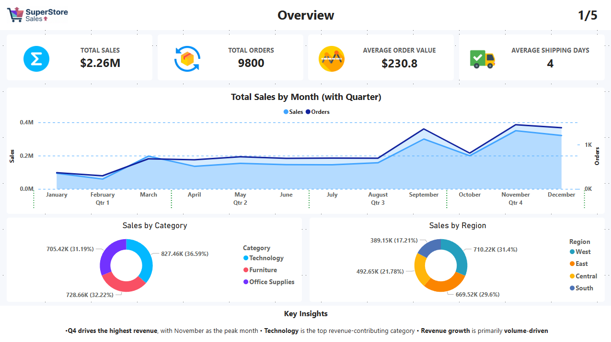
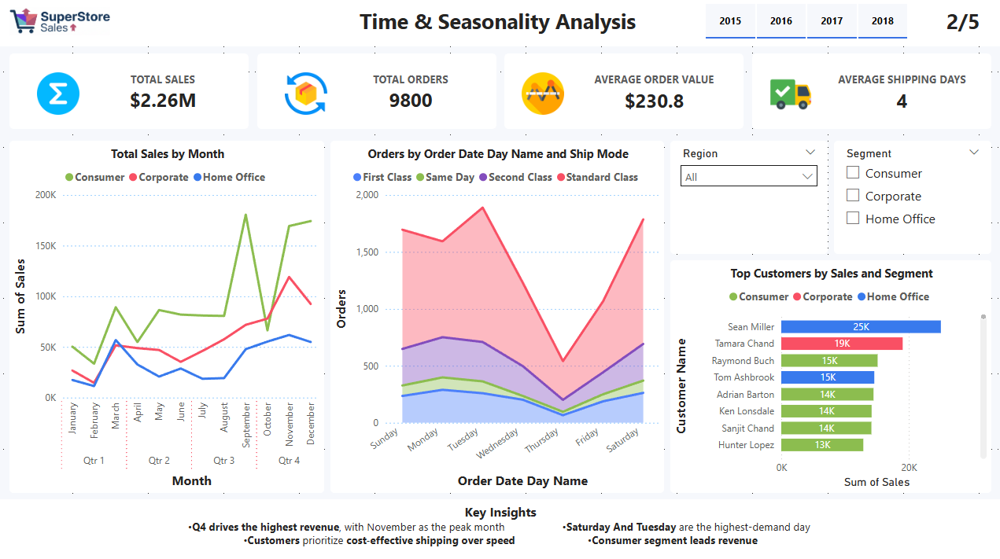
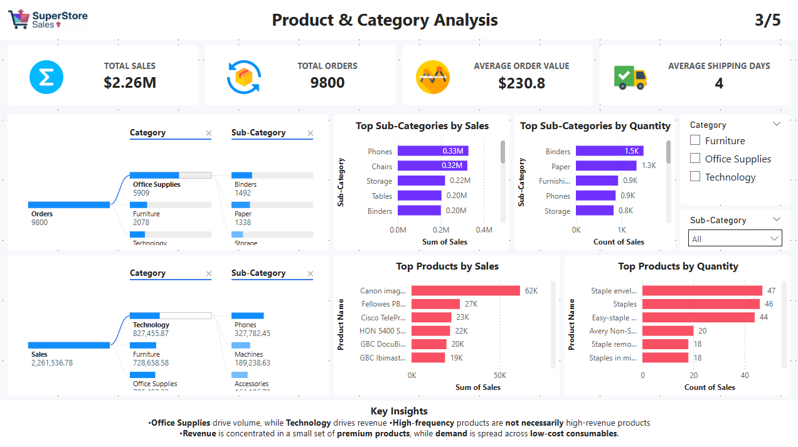
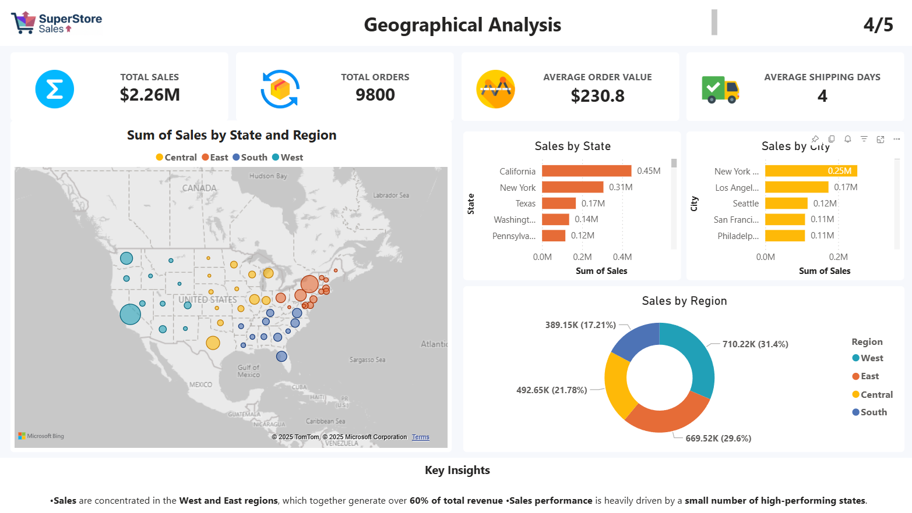
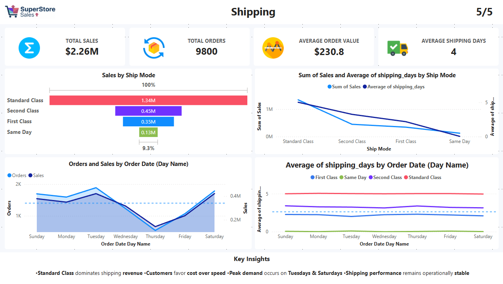

# 📊 SuperStore Sales Analysis | Power BI Dashboard

## 🔍 Project Overview
This project presents an end-to-end **Sales Analysis Dashboard** built using **Power BI**, based on the SuperStore sales dataset.  
The dashboard focuses on analyzing **sales performance, customer behavior, seasonality, product performance, geographical trends, and shipping efficiency**.

The objective is to convert raw transactional data into **clear, actionable business insights** that support data-driven decision-making.

---

## 🎯 Business Objectives
- Analyze overall sales performance using key KPIs  
- Identify seasonal and weekly demand patterns  
- Compare **order volume vs revenue value** across products  
- Evaluate geographical sales distribution  
- Assess shipping performance and customer delivery preferences  

---

## 📌 Key KPIs
| Metric | Value |
|------|------|
| **Total Sales** | $2.26M |
| **Total Orders** | 9,800 |
| **Average Order Value** | $230.8 |
| **Average Shipping Days** | 4 |

---

## 📈 Dashboard Structure

| Page | Title | Description | Key Visuals | Key Insights | ScreenShot |
|-----|------|------------|------------|--------------|--------|
| 1 | **Overview** | High-level summary of overall business performance and KPIs | KPI Cards, Sales & Orders Trend by Month, Sales by Category, Sales by Region | Q4 is the strongest sales period, Technology leads revenue, growth is volume-driven |
| 2 | **Time & Seasonality Analysis** | Analysis of monthly and weekly sales patterns and demand behavior | Sales by Month, Orders by Day Name, Orders by Day Name & Ship Mode | Clear seasonality with peaks in Q4, highest demand on Tuesdays and Saturdays |
| 3 | **Product & Category Analysis** | Comparison of product performance by order volume and revenue | Decomposition Tree (Orders vs Sales), Top Sub-Categories by Sales & Quantity, Top Products | Office Supplies drive volume, Technology drives revenue, clear volume vs value split |
| 4 | **Geographical Analysis** | Sales performance across regions, states, and cities | Map (Sales by State & Region), Sales by State, Sales by City, Sales by Region | West & East regions generate over 60% of revenue, sales concentrated in major cities |
| 5 | **Shipping Analysis** | Evaluation of shipping modes, delivery speed, and operational efficiency | Sales by Ship Mode, Avg Shipping Days by Ship Mode, Orders & Sales by Day Name | Standard Class dominates shipping, customers prioritize cost over speed |

---

## 📊 Live Power BI Dashboard

👉 Click  [here](https://app.powerbi.com/view?r=eyJrIjoiMWNiZTY2N2ItNDkyYi00OTZjLTk5MzQtMDgzMDZiNmU4MDE4IiwidCI6ImU0MGU0YTI1LTY2MzgtNGE3MS05NTViLTgyZWI5MDYwMjBiMSJ9)  to view the interactive dashboard

# SuperStore-Sales-Analysis-Power-BI-
